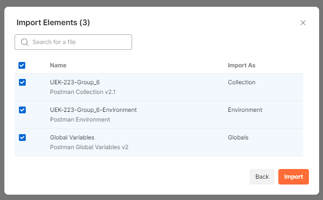
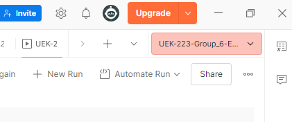
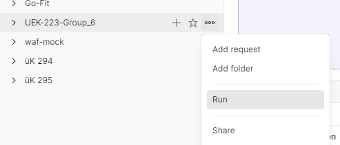
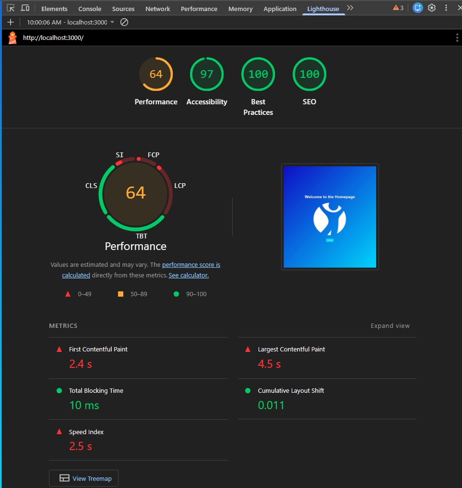

# Frontend Assignment Project üK 223

This is the frontend component for the üK 223 assignment, built with **React** and **Vite**.

## Getting Started

The project is located in the `frontend_react` directory.

### Prerequisites
- Node.js (Latest LTS recommended)
- Yarn package manager
- [Postman](https://www.postman.com/downloads/)
- [Lighthouse Extension](https://chromewebstore.google.com/detail/lighthouse/blipmdconlkpinefehnmjammfjpmpbjk?hl=en-US&utm_source=ext_sidebar)

### Installation and Run
```bash
cd ./frontend_react
yarn install
yarn dev
```

---

## Integration Testing

The project uses **Postman** for integration testing. The collection and environment files are located in the backend repository.

> **!IMPORTANT!**
> Please ensure the **backend is (re)started** before executing the tests to ensure a clean state.

### Postman Setup Guide

---

#### 1. Import Collection


Open Postman, click **Import**, and select the entire `postman` directory from the backend repository.

---

#### 2. Select Environment
Select the imported environment in the **top right corner**. 



> **!CAUTION!**
> The tests will fail if no environment is active.

---

#### 3. Run Collection


Click the **three dots** next to the collection, choose **Run**, and click **Run UEK-223-Group_6**.

---

#### 4. Check results


If they look something like this, everything went right :)

---

## E2E Testing

We use **Cypress** for end-to-end testing.

```bash
cd ./frontend_react
yarn install
yarn cypress open
```

---

## Non-Functional Testing

We use **Lighthouse** for non-functional testing.




---

## Login Credentials

| Role | Email | Password |
| :--- | :--- | :--- |
| **ADMIN** | `admin@example.com` | `1234` |
| **USER** | `user@example.com` | `1234` |
| **DEFAULT** | `default@example.com` | `1234` |

---

## Available Routes

| Path | Description |
| :--- | :--- |
| `localhost:3000` | **Homepage** |
| `/login` | Login page |
| `/user` | User dashboard/profile page |
| `/list` | Entries list overview |
| `/user/edit/user` | Edit personal profile |
| `/list/edit/list` | Edit personal lists |
| `/admin` | Admin dashboard |
| `/user/edit/admin` | User management (Admin only) |
| `/list/edit/admin` | List management (Admin only) |
